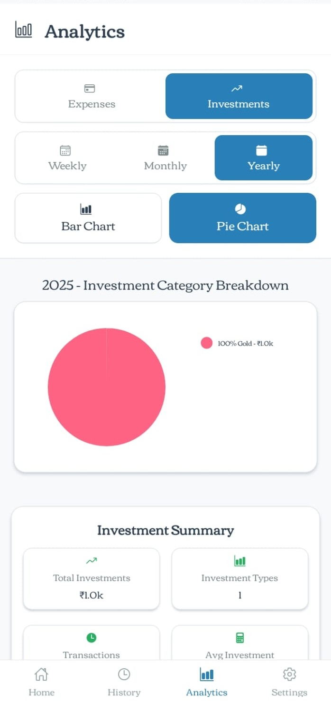

# Spendbook

## Download

**[Download APK](https://github.com/aRc-rAy/SpendBook/raw/main/release-files/spendbook-v1.0.0.apk)**

*Alternative: [Visit Repository](https://github.com/aRc-rAy/SpendBook) for source code*

## Features

- Track spending, expense and investment
- History on payments
- Analytics screen with bar and pie charts
- Dark and light theme support

## Screenshots

### Home Screen
Track all your transactions in one place with an intuitive dashboard.

### Bar Chart Analytics
Visualize your spending patterns with detailed bar charts showing weekly trends.

### Pie Chart Analytics
Get insights into your spending distribution across different categories.

### Settings
Customize your app preferences and manage your account settings.

### Widget View
Quick access to your financial data with home screen widgets.

